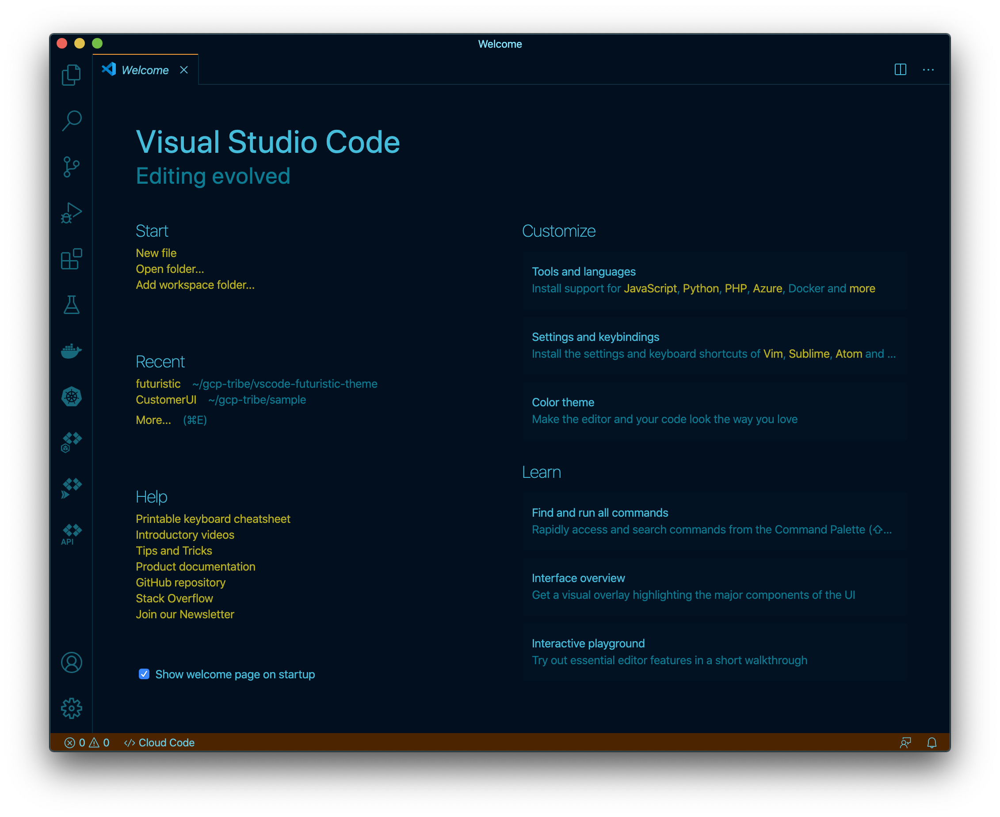
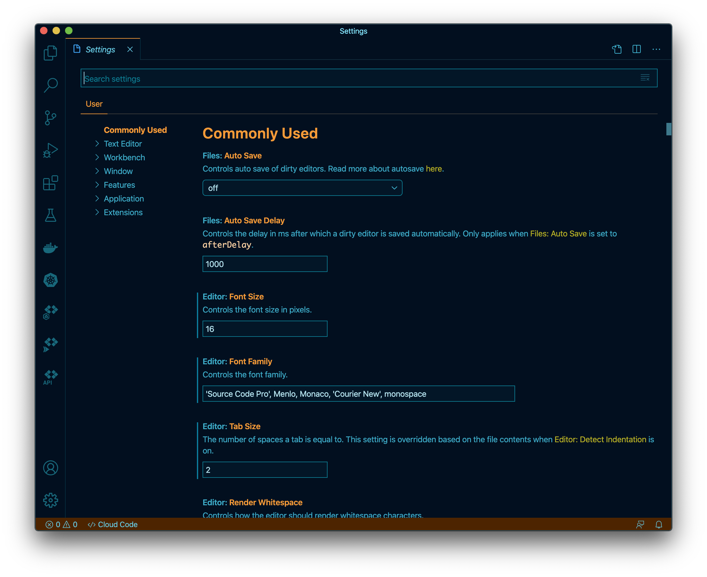
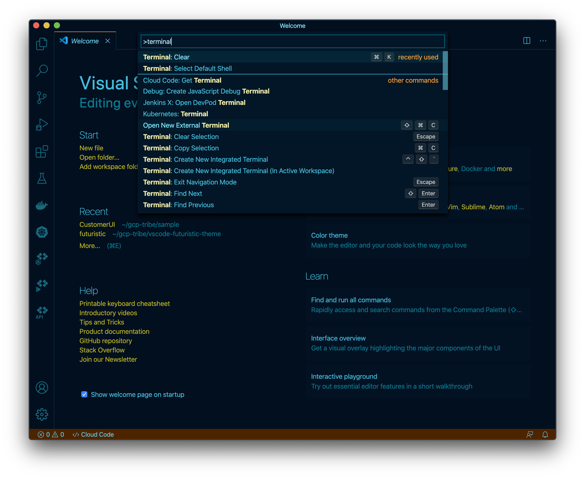

# Futuristic Dark Theme

Handcrafted `Futuristic` dark theme for **Visual Studio Code**.

   

## Screenshots

### Welcome Page

### Default (Blue)

### Green

### Settinngs Page

### Default (Blue)

### Green

### Editor

### Default (Blue)

### Green

### Editor Debug Mode

### Default (Blue)

### Green

### Quick Picker

### Default (Blue)

### Green

